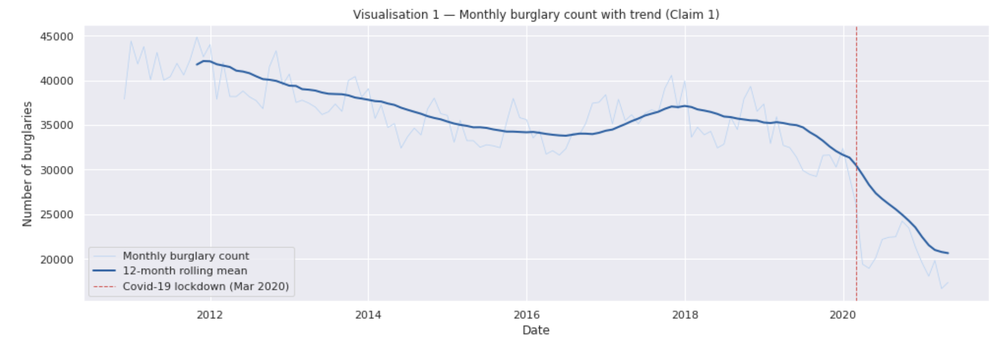
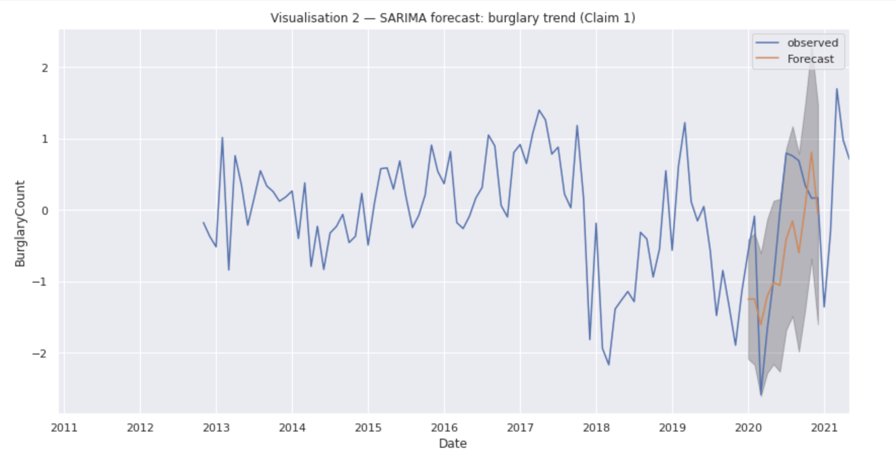
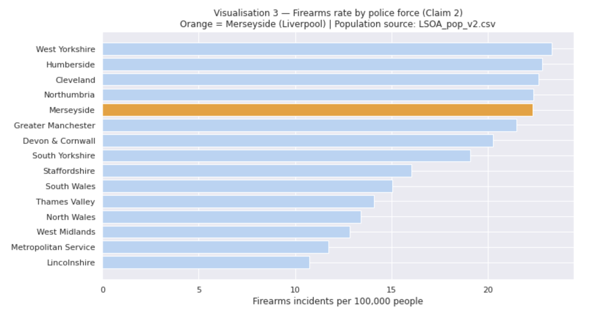
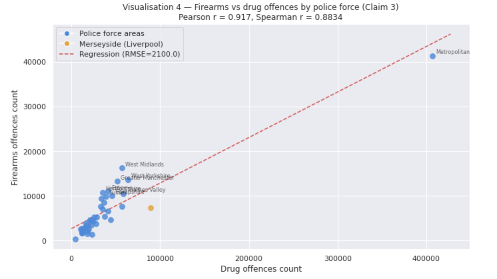

# UK Police Crime Data Analysis — Big Data Project

## Overview
This project investigates three claims about crime in the UK, using a 65-million-row 
police crime dataset processed with **Apache Spark** on **Microsoft Azure**. The same 
code was tested on a sample dataset and then run on the full dataset on Azure.

## Questions Investigated
1. Are burglary rates steadily increasing over time?
2. Does Liverpool (Merseyside) have the highest firearms incidents per capita in the UK?
3. Are firearms offences strongly linked to drug-related crimes?

## Tools & Methods
- **Apache Spark (PySpark)** — processing and joining millions of rows
- **Microsoft Azure** — cloud storage and compute for the full dataset
- **Spark MLlib** — correlation analysis and Linear Regression
- **SARIMA (time series forecasting)** with ADF stationarity testing
- **Pearson & Spearman correlation**
- Data visualisation with line charts, bar charts, and scatter plots

## Findings

### Claim 1 — Burglary rates increasing? (False)

Burglary actually **fell by about 50%** over 10 years — from ~42,000 cases/month 
(2011) to ~20,000/month (2021), with a sharp drop after the Covid-19 lockdown in 
March 2020. A SARIMA forecast model (AIC = 123.29) supports this — predicted future 
burglary stays flat, not rising.

### Claim 2 — Does Liverpool have the highest firearms rate per capita? (False)

After calculating firearms incidents per 100,000 people, **Merseyside Police 
(Liverpool) ranked 4th** in the UK — not 1st.

### Claim 3 — Are firearms offences linked to drug crime? (True)

Strong positive correlation found:
- Pearson correlation: **0.91**
- Spearman correlation: **0.85**
- Linear regression: for every extra drug offence, ~**0.10** extra firearms 
  offences are predicted

(Note: correlation does not prove cause — other factors like poverty and 
population size may also play a role.)

## Ethical Considerations
The dataset includes location data (latitude/longitude), which raises privacy 
concerns — these coordinates could reveal patterns about under-policed areas. 
A safer approach would be to anonymise locations to the nearest road, as some 
police forces already do.

## Why Apache Spark + Azure?
The full dataset contains **65 million records** — too large for tools like 
Excel. Spark allowed filtering, joining, and analysis to run in minutes instead 
of hours, and the same code scaled from a small sample to the full dataset on Azure.

## Dataset Sources
- UK Home Office street-level crime data (2021)
- ONS LSOA population data (2011)
- Note: raw dataset not included in this repo due to size (65 million records). 
  Available publicly from data.police.uk and the ONS website.

## How to Run
1. Open `UKPoliceCrimeBigDataProject.ipynb` in Jupyter
2. Ensure PySpark and required libraries are installed
3. Run cells in order 
